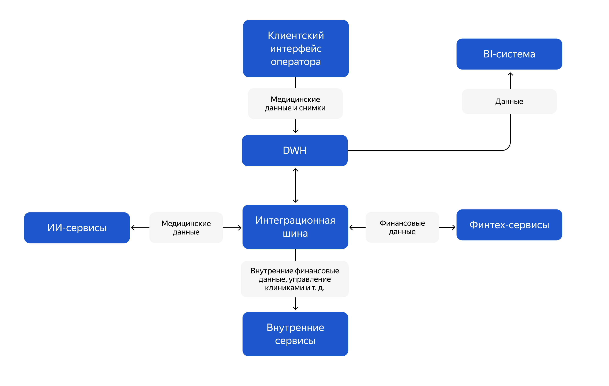

# architecture future-2.0

## Сдача проектной работы 11 спринта

В этом спринте вы будете работать над кейсом компании «Будущее 2.0».

### О компании

Компания «Будущее 2.0» начинала как медицинский стартап, а со временем выросла в успешный бизнес. Сегодня её врачи 
используют современное оборудование и системы искусственного интеллекта для постановки диагнозов и назначения лечения. 
А недавно компания купила банк, чтобы дополнить свои медицинские услуги финансовыми сервисами. В ближайших планах — 
интегрировать в экосистему нескольких фармацевтических компаний и производителя электроники для медицинского оборудования.

Изначально все корпоративные данные в «Будущем 2.0» хранились в DWH, построенном на базе SQL Server. В нём была реализована 
значительная часть бизнес-логики, а для работы операторов в клиниках использовался интерфейс на PowerBuilder.

В DWH лежат:
 - Данные по клиентам.
 - Медицинские карты и истории болезни, в том числе данные исследований, включая результаты диагностических исследований, 
   проведённых в ходе лечения.
 - Финансовая история.
 - Счета.
 - Данные о кредитах.
 - Данные по персоналу больницы.
 - Данные по инвентаризации.
 - Финансовая отчётность и много другой информации.

«Будущее 2.0» хочет развивать каждое из своих направлений отдельно, сохраняя при этом целостное представление по ключевым 
бизнес-показателям. Однако уже сейчас построение необходимой отчётности занимает слишком много времени. Объём данных 
измеряется сотнями терабайт, а сценариев их использования — невероятное множество, что приводит к большому количеству 
трансформаций. В результате замедляется time-to-market и падает производительность аналитических процессов: формирование 
сложных отчётов может занимать часы.  

В ближайшее время компания «Будущее 2.0» планирует перенести основную часть своего IT-ландшафта в облачную инфраструктуру. 
Этот шаг позволит быстрее масштабировать ресурсы для работы с данными и гибко подключать новые бизнес-направления, а также 
сократит затраты на поддержку устаревшего оборудования. В облаке предполагается выстраивать отдельные среды для разных 
доменов, чтобы обеспечить их независимость и упростить развитие.

Переезд в облако также рассматривается как способ повысить надёжность и доступность сервисов. Для критичных систем будут 
использоваться механизмы отказоустойчивости, резервного копирования и геораспределённого развёртывания. При этом ключевой 
задачей останется обеспечение информационной безопасности и соблюдение требований регуляторов, особенно в части работы с 
медицинскими и финансовыми данными.

## Что нужно сделать

Руководство «Будущего 2.0» поставило перед командой две задачи:
1. Создать удобную «витрину данных» — портала самообслуживания, который можно легко масштабировать вне зависимости от 
   количества бизнес-направлений и их целей. Планируется, что сотрудник сможет получить в этой системе отчёт по любым 
   необходимым срезам в пределах своего уровня доступа, а также конструировать собственные отчёты. Важно подчеркнуть, 
   что в «витрину данных» не будут включаться медицинские карты, истории болезней и результаты медицинских исследований. 
   Эти данные компания не предполагает использовать для аналитики.
2. Предоставить архитектурное решение по изменению IТ-ландшафта в области работы с данными. Оно должно обеспечить интеграцию 
   новых бизнес-направлений без необходимости вносить значительные объёмы бизнес-логики в DWH.

Бизнес разрешил при необходимости отказаться от легаси-систем и мигрировать на новые сервисы, если вы предоставите весомое обоснование.

### Лендскейп компании

В структуре компании есть четыре подразделения:
 - Головной офис;
 - Клиники;
 - Компания, предоставляющая ИИ-сервисы для работы с медицинскими данными;
 - Компания, оказывающая финтех-услуги и обладающая банковской лицензией.

В рамках проектной работы будет необходимо работать с такими продуктами:
 - Финтех-сервисами;
 - Внутренней медицинской системой (DWH) с клиентским интерфейсом и дополнительной бизнес-логикой под финтех и ИИ-сервисы;
 - BI-системой с большим количеством кастомизаций поверх DWH;
 - ИИ-сервисами для работы с медицинскими данными;
 - Интеграционным слоем через старую шину данных.

Сейчас в «Будущем 2.0» развёрнуты следующие технологии, сервисы и приложения:
 - DWH на базе Microsoft SQL-сервера 2008 года;
 - Power BI;
 - Power Builder;
 - Шина на базе Apache Camel;
 - ИИ-сервисы на Python;
 - Финтех-сервисы на Golang и Java.

Так выглядят потоки данных в компании «Будущего 2.0»:

### Цели бизнеса

Промежуточное состояние (через пару месяцев)
 - Архитектурное решение по трансформации сформировано и согласовано.
 - Границы доменов определены, а ключевые связи между ними описаны.
 - В доменах запланированы конкретные проекты по развитию «витрины данных».

Финальное состояние (через год)
 - Реализован портал самообслуживания.
 - Бизнес-пользователи в доменах могут работать с данными в рамках новой архитектуры.
 - На этом этапе допускается временное сохранение легаси-систем в отдельных доменах.

## Как подготовиться к работе

Подготовьте репозиторий, куда вы будете загружать решения заданий:
1. Проект этого спринта вы будете сдавать в Git-репозитории. Создайте публичный репозиторий в GitHub или GitLab. 
   Назовите его «architecture-future_2_0».
2. Проект состоит из четырёх заданий. Решение каждого задания нужно будет залить в отдельную директорию. Создайте в 
   репозитории четыре директории и назовите их «Task1», «Task2», «Task3» и «Task4».
3. Чтобы ревьюеру было проще проверять вашу работу, а вам отслеживать изменения на разных итерациях, загрузите файлы в 
   свой репозиторий и сделайте пул-реквест. На ревью нужно отправить ссылку на пул-реквест.

Если репозиторий готов, то можно приступать к заданиям!
