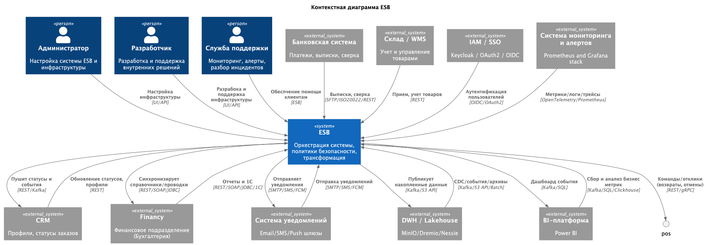

## 1. Целевая архитектура

C4-context:

C4-containers:

# 2. Проблемные зоны целевой трансформации

1. Наличие legacy-системы, на которую требуется выделение человеко-ресурсов последующей поддержки с целью постепенного перехода на новую систему;
2. Необходимую отчетность крайне сложно выстроить за разумное время, в том числе учитывая 1ый пункт;
3. Огромное количество данных (сотни террабайт), накопленные за всё время, которое необходимо обработать и трансформировать под новую систему;
4. Высокое время ожидания генерации отчетов, что замедляет принятие решений, а также плохо сказывается на лояльности пользователей;
5. Нехватка ресурсов (их всегда нехватает).

## Приоритизация (MoSCoW)

| №   | Приоритет | Обоснование                                                                                                                             |
| --- | --------- |-----------------------------------------------------------------------------------------------------------------------------------------|
| 1   | Must      | Критично! Необходимо сократить время подготовки отчётности для принятия решений; напрямую влияет на выручку, лояльность и эффективность |
| 2   | Must      | Независимое развитие доменов определено бизнес-целью; без декомпозиции логики fintech и AI не смогут выпускать продукты                 |
| 3   | Must      | Витрина данных — ключевой артефакт целевой архитектуры; без неё не будет самообслуживания                                               |
| 5   | Must      | Регуляторные требования к медицине и финтеху обязательны; нарушение грозит штрафами и остановкой бизнеса                                |
| 4   | Should    | Поддерживает масштабирование новых направлений; критично после стабилизации основных доменов                                            |
