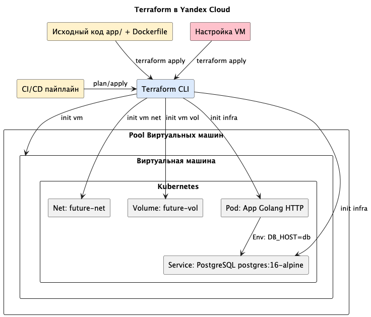
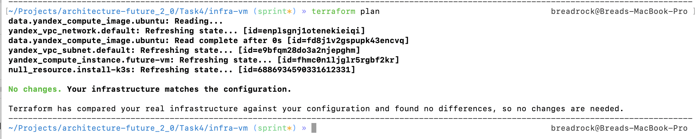
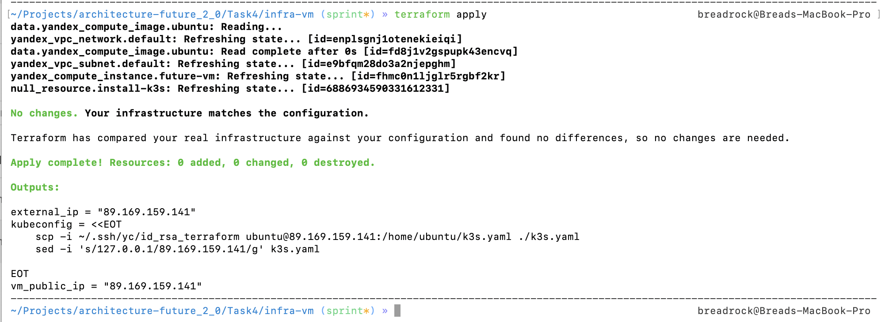
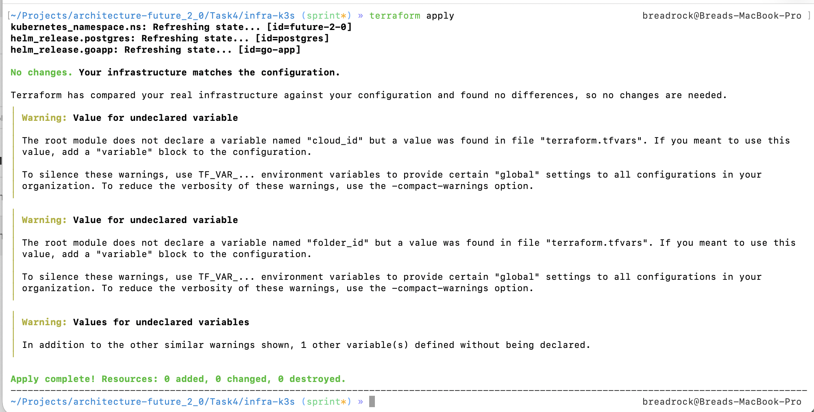
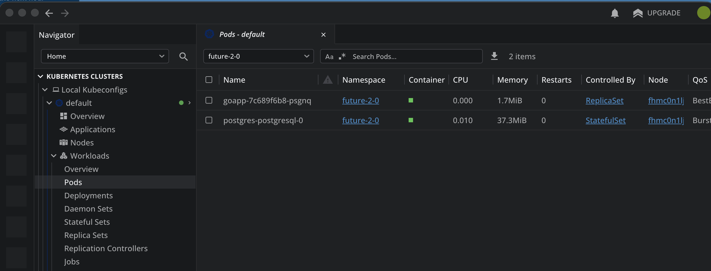
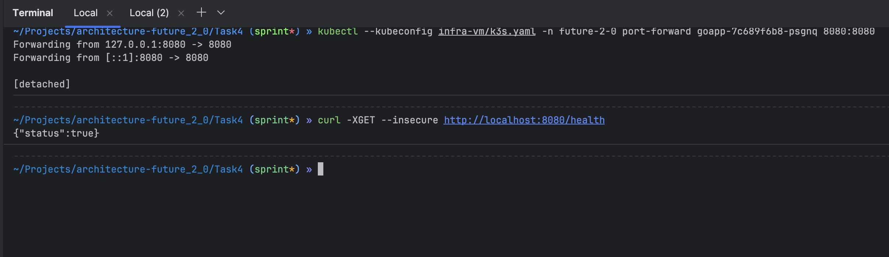

# Задание 4. Автоматизация развёртывания

Как было описано ранее, в качетсве конфигурации были выбраны terraform и k3s. Однако стоит отметить еще одну особенность -
инициализация всей инфраструктуры будет проводиться в 2 этапа: 
 1. Создание виртуальной машины с настройкой k3s и выгрузкой kubeconfig;
 2. Деплой всей инфраструктуры компании в k3s. 

Почему так? Дело в том, что, в целом, неплохо разделить по ответственности две terraform-проекта. Второй момент заключается в том,
что terrafrom не позволяет ожидать выполнение задач - к примеру, возникает проблема при выгрузке kubeconfig и последующему
деплою инфраструктуры.

## Диаграмма




## Как запустить

**Warning**
В первую очередь нужно настроить `terraform` подключение к провайдеру. Я использую Yandex Cloud. Для его подключения необходимо 
скопировать или поменять в манифестах `main.tf` путь до `key.json` файла. 

**Warning**
А также не забудьте создать ssh-key без passphrase для успешной настройки.
```shell
ssh-keygen -a 100 -b 8192 -t rsa -N '' 
```

### Шаг 1. Создание VM
Сперва необходимо создать VM, для этого необходимо выполнить следующие шаги:

```shell
cd ./Task4/infra-vm

terraform init
terraform plan
terraform apply
```

В stdout будет выведен `public nat` адрес нашей виртуалки, используем его для сохранения kubeconfig:
```shell
VM_IP=<vm-public-ip>
scp -i ~/.ssh/id_rsa ubuntu@$VM_IP:/home/ubuntu/k3s.yaml ./k3s.yaml
sed -i 's/127.0.0.1/$VM_IP/g' k3s.yaml
```




Пример stdout при выполнении `terrafrom apply`:
[init-vm.output](docs/init-vm.output)

Мне потребовался дополнительный шаг при настройке - нужно было отключить tls в k3s настройках. Для этого я подключился
к VM по ssh и настроить `/etc/rancher/k3s/config.yaml`:
```shell
tls-san:
  - $VM_IP
```

Перезапускаем k3s:
```shell
sudo systemctl restart k3s
```

### Шаг 2. Поднятие инфраструктуры

**Warning**
Не забываем, что нужно настроить `terraform` подключение к провайдеру. Я использую Yandex Cloud. Для его п
одключения необходимо скопировать или поменять в манифестах `main.tf` путь до `key.json` файла.

Со 2ым шагом, всё гораздо проще:

```shell
terraform init
terraform plan
terraform apply
```




Пример stdout при выполнении `terrafrom apply`:
[init-k3s.output](docs/init-k3s.output)

### Проверка

Всё поднялось:


Достаточно только прокинуть порт наружу в k3s для go-app:

